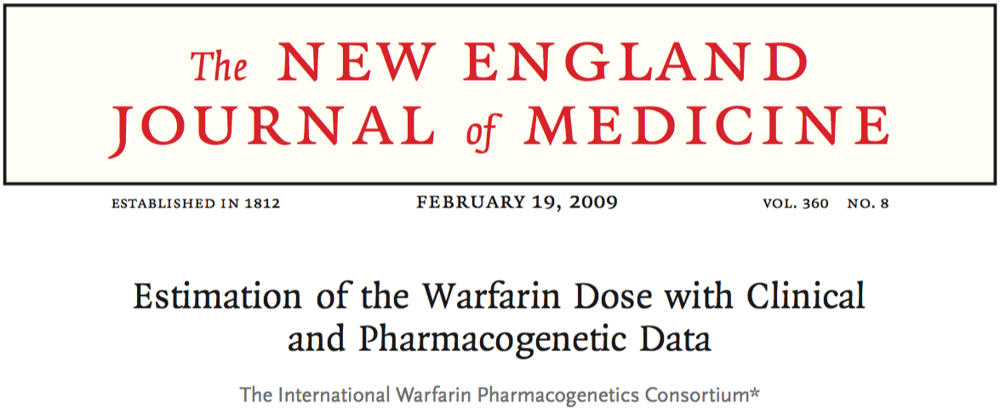

```{r setup, include=FALSE}
knitr::opts_chunk$set(echo = FALSE)
libraries <- c("readr", "knitr", "DT", "purrr", "lubridate", "stringr", "tidyr", "ggplot2", "broom", "dplyr","magrittr")
libs_to_install <- libraries[!(libraries %in% installed.packages()[,"Package"])]
if(length(libs_to_install)>0){install.packages(libs_to_install)}

library(magrittr)
library(knitr)
library(readr)
library(DT)
library(purrr)
library(lubridate)
library(stringr)
library(broom)
library(tidyr)
library(ggplot2)
library(dplyr)
```

## Setting Expectations

**Expect to:**

> 1. Get a sense of what is possible with R.
> 2. Set up important frameworks around how to do data science (forewarning - I'm biased!)
> 3. Be warned of potential minefields

**Do Not Expect to:**

>1. Completely understand all the code presented on your first try.
>2. Be exposed to all of the features of the mentioned packages.

## The Data Scientist's Workflow


<div class="citation">
Adapted from:

 - David Robinson (http://varianceexplained.org/files/broom_presentation.pdf)
 - Philip Guo (http://cacm.acm.org/blogs/blog-cacm/169199-data-science-workflow-overview-and-challenges/fulltext)
</div>

## R Solutions 


## Case Study Overview

<div class = "goal">
  **Goal:** Reproduce the final pharmacogenomic regression model and create an interactive web dose calculator.
</div>
<br>


This study used clinical and genetic data from a broad population to estimate appropriate warfarin dose for patients newly starting warfarin.

The [main data set](https://www.pharmgkb.org/download.do?objId=553247439&objCls=SubmissionEvent&ext=.xls) for the study is available on [PharmGKB](https://www.pharmgkb.org/downloads/). 

## Data Set 


This data set is in an excel file and presents some challenges:

 -  Column names with odd symbols
 -  Data types change with different project sites

For the purpose of this tutorial I have reduced the complexity of the data set and converted it to a tab-delimited file available on my [GitHub ](https://github.com/laurakwiley/AMIA-2015---Using-R-for-Healthcare-Data-Science). We will use read.delim() to deal with the odd column names.

```{r read_data, echo=TRUE}
iwpc_data <- read.delim(file = "iwpc_data_7_3_09_revised3.txt")
iwpc_data %<>% tbl_df()
```


## Checking out our Data {.smaller}

```{r display raw data, echo = TRUE}
iwpc_data %>% 
  group_by(Project.Site) %>% 
  sample_n(1) %>% 
  datatable(rownames = FALSE, options = list(pageLength=2, scrollX = TRUE))
```

## Tidying our Data - Column Names{.smaller}

```{r tidydata, echo = TRUE}
iwpc_data %<>% 
  rename(subject_id = PharmGKB.Subject.ID,
         sample_id = PharmGKB.Sample.ID,
         project_site = Project.Site,
         gender = Gender,
         race_reported = Race..Reported.,
         race_omb = Race..OMB.,
         ethnicity_reported = Ethnicity..Reported.,
         ethnicitiy_omb = Ethnicity..OMB.,
         age = Age,
         height = Height..cm.,
         weight = Weight..kg.,
         indication = Indication.for.Warfarin.Treatment,
         comorbidities = Comorbidities,
         medications = Medications,
         target_inr = Target.INR,
         target_inr_estimated = Estimated.Target.INR.Range.Based.on.Indication,
         reached_stable_dose = Subject.Reached.Stable.Dose.of.Warfarin,
         therapeutic_warfarin_dose = Therapeutic.Dose.of.Warfarin,
         inr_on_warfarin = INR.on.Reported.Therapeutic.Dose.of.Warfarin,
         smoker = Current.Smoker,
         cyp2c9_consensus = CYP2C9.consensus,
         vkorc1_1639_consensus = VKORC1..1639.consensus)
```

## Data Manipulation - Which Variables? {.smaller}

<div class="columns-2">
 **They Used:**
 
 - Age in decades = 1 for 10-19, etc...
 - VKORC1 G/A = 1 if heterozygous
 - VKORC1 A/A = 1 if homozygous for A
 - VKORC1 genotype unknown = 1 
 - CYP2C9 \*1/\*2 = 1 if \*1/\*2
 - CYP2C9 \*1/\*3 = 1 if \*1/\*3
 - CYP2C9 \*2/\*2 = 1 if homozygous \*2 
 - CYP2C9 \*2/\*3 = 1 if \*2/\*3
 - CYP2C9 \*3/\*3 = 1 if homozygous \*3
 - CYP2C9 genotype unknown = 1 
 - Asian Race = 1
 - Black/African American = 1
 - Missing or Mixed race = 1
 
  <br>
  
 - Amiodarone status = 1
 - Enzyme inducer status = 1 if any of: rifampin, carbamazepine, phenytoin, rifampicin

  **We Have:**
  
 - Age: 10-19, 20-29, 30-39 etc.
 - VKORC1: A/A, A/G, G/G
 - CYP2C9: combinations of: \*1, \*2, \*3, \*5, \*6, \*8, \*11, etc.
 - Race: Asian, Black or African America, White, Other
 - Medications: character list of medications, lack of medications, etc.
 
 </div>

## Data Manipulation: Dummy Code Race {.smaller .build}

```{r race_1, echo=TRUE}
iwpc_data %<>% 
  mutate(asian = ifelse(str_detect(race_omb, "Asian"),
                        yes = 1,
                        no = 0),
         african_american = ifelse(str_detect(race_omb, "Black or African American"),
                                   yes = 1, 
                                   no = 0),
         missing_or_mixed_race = ifelse(str_detect(race_omb, "Unknown"),
                                        yes = 1,
                                        no = 0))
```
```{r race_2}
iwpc_data %>% 
  count(race_omb, asian, african_american, missing_or_mixed_race) %>% 
  datatable(colnames = c("Race OMB","Asian","African American","Missing/Mixed Race","N"), rownames = FALSE, options = list(pageLength = 12, bFilter = FALSE, info = FALSE, paging = FALSE))
```


## Data Manipulation: VKORC1 {.smaller .build}

```{r vkorc1_1, echo = TRUE, eval=FALSE}
iwpc_data %>% 
  mutate(vkorc1_1639_ag = ifelse(str_detect(vkorc1_1639_consensus,"A/G"),
                                 yes = 1, no = 0),
         vkorc1_1639_aa = ifelse(str_detect(vkorc1_1639_consensus, "A/A"),
                                 yes = 1,no = 0),
         vkorc1_1639_unknown = ifelse(is.na(vkorc1_1639_consensus),
                                      yes = 1,no = 0))
```

```{r vkorc1_2}
iwpc_data %>% 
  mutate(vkorc1_1639_ag = ifelse(str_detect(vkorc1_1639_consensus,"A/G"),
                                 yes = 1, no = 0),
         vkorc1_1639_aa = ifelse(str_detect(vkorc1_1639_consensus, "A/A"),
                                 yes = 1,no = 0),
         vkorc1_1639_unknown = ifelse(is.na(vkorc1_1639_consensus),
                                      yes = 1,no = 0)) %>% 
  count(vkorc1_1639_consensus,vkorc1_1639_ag,vkorc1_1639_aa,vkorc1_1639_unknown) %>% 
  ungroup() %>% 
  mutate(vkorc1_1639_consensus = ifelse(is.na(vkorc1_1639_consensus), "NA", vkorc1_1639_consensus ), 
         vkorc1_1639_ag = ifelse(is.na(vkorc1_1639_ag), "NA", vkorc1_1639_ag), 
         vkorc1_1639_aa = ifelse(is.na(vkorc1_1639_aa), "NA", vkorc1_1639_aa), 
         vkorc1_1639_unknown = ifelse(is.na(vkorc1_1639_unknown), "NA", vkorc1_1639_unknown)) %>% 
  datatable(colnames = c("VKORC1 1639","VKORC1 A/G","VKORC1 A/A","VKORC1 Unknown","N"), rownames = FALSE, options = list(pageLength = 12, bFilter = FALSE, info = FALSE, paging = FALSE))
```

<br>
<div class="warning">
**Warning:** Running str_detect() on NA returns NA.  If you don't know that data value, R doesn't know if there's a match!
</div>


## Data Manipulation: VKORC1 {.smaller}

```{r vkorc1_3, echo = TRUE}
iwpc_data %<>% 
  mutate(vkorc1_1639_ag = ifelse(is.na(vkorc1_1639_consensus) | 
                                   !str_detect(vkorc1_1639_consensus,"A/G"),
                                 yes = 0,  no = 1),
         vkorc1_1639_aa = ifelse(is.na(vkorc1_1639_consensus) | 
                                   !str_detect(vkorc1_1639_consensus, "A/A"),
                                 yes = 0, no = 1),
         vkorc1_1639_unknown = ifelse(is.na(vkorc1_1639_consensus),
                                      yes = 1, no = 0))
```

```{r vkorc1_4}
iwpc_data %>% 
  mutate(vkorc1_1639_ag = ifelse(is.na(vkorc1_1639_consensus)|!str_detect(vkorc1_1639_consensus,"A/G"),yes = 0,no = 1),
         vkorc1_1639_aa = ifelse(is.na(vkorc1_1639_consensus)|!str_detect(vkorc1_1639_consensus, "A/A"),yes = 0,no = 1),
         vkorc1_1639_unknown = ifelse(is.na(vkorc1_1639_consensus),yes = 1,no = 0)) %>% 
  count(vkorc1_1639_consensus,vkorc1_1639_ag,vkorc1_1639_aa,vkorc1_1639_unknown) %>% 
  ungroup() %>% 
  mutate(vkorc1_1639_consensus = ifelse(is.na(vkorc1_1639_consensus), "NA", vkorc1_1639_consensus)) %>% 
  datatable(colnames = c("VKORC1 1639","VKORC1 A/G","VKORC1 A/A","VKORC1 Unknown","N"), rownames = FALSE, options = list(pageLength = 12, bFilter = FALSE, info = FALSE, paging = FALSE))
```

## Data Manipulation: CYP2C9 {.smaller}

```{r cyp2c9_1, echo = TRUE}
iwpc_data %<>% 
  mutate(cyp2c9_1_2 = ifelse(is.na(cyp2c9_consensus) |
                               !str_detect(cyp2c9_consensus,"\\*1/\\*2"),
                             yes = 0, no = 1),
         cyp2c9_1_3 = ifelse(is.na(cyp2c9_consensus) |
                               !str_detect(cyp2c9_consensus,"\\*1/\\*3"),
                             yes = 0, no = 1),
         cyp2c9_2_2 = ifelse(is.na(cyp2c9_consensus) |
                               !str_detect(cyp2c9_consensus,"\\*2/\\*2"),
                             yes = 0, no = 1),
         cyp2c9_2_3 = ifelse(is.na(cyp2c9_consensus) |
                               !str_detect(cyp2c9_consensus,"\\*2/\\*3"),
                             yes = 0, no = 1),
         cyp2c9_3_3 = ifelse(is.na(cyp2c9_consensus) |
                               !str_detect(cyp2c9_consensus,"\\*3/\\*3"),
                             yes = 0, no = 1),
         cyp2c9_unknown = ifelse(is.na(cyp2c9_consensus),
                                 yes = 1,no = 0))
```

## Data Manipulation: CYP2C9 {.smaller}

```{r cyp2c9_2}
iwpc_data %>% 
  mutate(cyp2c9_1_2 = ifelse(is.na(cyp2c9_consensus)|!str_detect(cyp2c9_consensus,"\\*1/\\*2"),yes = 0,no = 1),
         cyp2c9_1_3 = ifelse(is.na(cyp2c9_consensus)|!str_detect(cyp2c9_consensus,"\\*1/\\*3"),yes = 0,no = 1),
         cyp2c9_2_2 = ifelse(is.na(cyp2c9_consensus)|!str_detect(cyp2c9_consensus,"\\*2/\\*2"),yes = 0,no = 1),
         cyp2c9_2_3 = ifelse(is.na(cyp2c9_consensus)|!str_detect(cyp2c9_consensus,"\\*2/\\*3"),yes = 0,no = 1),
         cyp2c9_3_3 = ifelse(is.na(cyp2c9_consensus)|!str_detect(cyp2c9_consensus,"\\*3/\\*3"),yes = 0,no = 1),
         cyp2c9_unknown = ifelse(is.na(cyp2c9_consensus),yes = 1,no = 0)) %>% 
  count(cyp2c9_consensus, cyp2c9_1_2, cyp2c9_1_3,cyp2c9_2_2,cyp2c9_2_3,cyp2c9_3_3,cyp2c9_unknown) %>% 
  ungroup() %>% 
  mutate(cyp2c9_consensus = ifelse(is.na(cyp2c9_consensus), "NA", as.character(cyp2c9_consensus))) %>% 
  datatable(colnames = c("CYP2C9","*1/*2","*1/*3","*2/*2","*2/*3","*3/*3","Unknown","N"), rownames = FALSE, options = list(pageLength = 12, bFilter = FALSE, info = FALSE, paging = FALSE))
```

## Data Manipulation: Medications {.smaller}

```{r medications, echo=TRUE, eval = FALSE}
iwpc_data %<>% mutate(medications = tolower(medications))
```
```{r medications_2}
iwpc_data %>% filter(str_detect(medications, "amiodarone")) %>% 
  count(medications) %>%
  datatable(colnames = c("Medications", "N"), rownames = FALSE, options = list(pageLength = 5))
```

## Data Manipulation: Amiodarone {.smaller}

```{r amiodarone1a, echo=TRUE, eval = FALSE}
iwpc_data %>% filter(str_detect(medications, "amiodarone")) %>% count()
```

```{r amiodarone1b}
iwpc_data %>% 
  filter(str_detect(medications, "amiodarone")) %>% 
  count() %>%  datatable(colnames = c("N"), rownames = FALSE, options = list(bFilter = FALSE, info = FALSE, paging = FALSE, ordering = FALSE), width = 10)
```


```{r amiodarone2a, echo=TRUE, eval = FALSE}
iwpc_data %>% filter(str_detect(medications, "amiodarone")) %>% count(medications)
```

```{r amiodarone2b}
iwpc_data %>% filter(str_detect(medications, "amiodarone")) %>% count(medications) %>% 
  datatable(colnames = c("Medications", "N"), rownames = FALSE, options = list(pageLength = 5))
```

```{r amiodarone3, echo=FALSE}
iwpc_data %>% filter(str_detect(medications, "amio")) %>% filter(!str_detect(medications, "amiodarone")) %>% select(medications)

iwpc_data %>% filter(str_detect(medications, "amiodarone")) %>% count(medications)
iwpc_data %>% filter(str_detect(medications, "amiodarone")) %>% count()

iwpc_data %>% filter(str_detect(medications, "(^|;)[a-z ]*amiodarone")) %>% count()
iwpc_data %>% mutate(medications = str_extract(medications, "(^|;)[a-z ]*amiodarone")) %>% count(medications)
iwpc_data %>% mutate(medications = str_extract(medications, "(^|;)[a-z ]*amiodarone"),amiodarone_test = str_detect(medications, "(; amiodarone)|(^[a-z ]*amiodarone)")) %>% count(medications,amiodarone_test)
iwpc_data %>% mutate(medications_temp = str_extract(medications, "(^|;)[a-z ]*amiodarone"), amiodarone_test = str_detect(medications, "(; amiodarone)|(^[a-z ]*amiodarone)"), test = ifelse(is.na(medications)|!str_detect(medications, "(; amiodarone)|(^[a-z ]*amiodarone)"),yes = 0,no = 1)) %>% count(medications_temp,amiodarone_test,test)


iwpc_data %<>% mutate(amiodarone = ifelse(is.na(medications)|!str_detect(medications, "(; amiodarone)|(^[a-z ]*amiodarone)"),yes = 0,no = 1))
```

## Data Manipulation: Enzyme Enducers

```{r enzyme_inducers, echo=TRUE}
#### Carbamazepine
iwpc_data %>% filter(str_detect(medications,"carbamazepine")) %>% count()
iwpc_data %>% filter(str_detect(medications,"(^|;)[a-z ]*carbamazepine")) %>% count()
iwpc_data %>% mutate(medications_temp = str_extract(medications,"(^|;)[a-z ]*carbamazepine")) %>% count(medications_temp)
iwpc_data %<>% mutate(carbamazepine = ifelse(is.na(medications)|!str_detect(medications,"(^|;)[a-z ]*carbamazepine"),yes = 0,no = 1))

#### Phenytoin
iwpc_data %>% filter(str_detect(medications,"phenytoin")) %>% count()
iwpc_data %>% filter(str_detect(medications,"(^|;)[a-z ]*phenytoin")) %>% count()
iwpc_data %>% mutate(medications_temp = str_extract(medications,"(^|;)[a-z ]*phenytoin")) %>% count(medications_temp)
iwpc_data %<>% mutate(phenytoin = ifelse(is.na(medications)|!str_detect(medications,"(^|;)[a-z ]*phenytoin"),yes = 0,no = 1))

#### rifampin
iwpc_data %>% filter(str_detect(medications,"rifampin")) %>% count()
iwpc_data %>% filter(str_detect(medications,"(^|;)[a-z ]*rifampin")) %>% count()
iwpc_data %>% mutate(medications_temp = str_extract(medications,"(^|;)[a-z ]*rifampin")) %>% count(medications_temp)
iwpc_data %<>% mutate(rifampin = ifelse(is.na(medications)|!str_detect(medications,"(^|;)[a-z ]*rifampin"),yes = 0,no = 1))

#### rifampicin
iwpc_data %>% filter(str_detect(medications,"rifampicin")) %>% count()
iwpc_data %>% filter(str_detect(medications,"(^|;)[a-z ]*rifampicin")) %>% count()
iwpc_data %>% mutate(medications_temp = str_extract(medications,"(^|;)[a-z ]*rifampicin")) %>% count(medications_temp)
iwpc_data %<>% mutate(rifampicin = ifelse(is.na(medications)|!str_detect(medications,"(^|;)[a-z ]*rifampicin"),yes = 0,no = 1))

#### enzyme
iwpc_data %>% mutate(enzyme_enducer = ifelse((carbamazepine+phenytoin+rifampin+rifampicin)>0,yes = 1,no = 0)) %>% count(carbamazepine,phenytoin,rifampin,rifampicin,enzyme_enducer)

iwpc_data %<>% mutate(enzyme_enducer = ifelse((carbamazepine+phenytoin+rifampin+rifampicin)>0,yes = 1,no = 0))

```

## Data Manipulation: Age

```{r age, echo=TRUE}
iwpc_data %>% count(age)
iwpc_data %>% count(age, substr(age,1,1), as.numeric(substr(age,1,1)))
iwpc_data %>% mutate(age_decades = as.numeric(substr(age,1,1)))
```


## Data Visualization: Warfarin Dose

```{r warfarin_1, echo=TRUE}
iwpc_data %>% count(therapeutic_warfarin_dose)
iwpc_data %>% ggplot(aes(x=1,y = therapeutic_warfarin_dose)) + geom_boxplot()
iwpc_data %>% ggplot(aes(x=1,y = sqrt(therapeutic_warfarin_dose))) + geom_boxplot()

```


## Data Manipulation: Warfarin Dose
```{r warfarin_dose_2, echo=TRUE}
iwpc_data %>% count(reached_stable_dose)
iwpc_data %<>% filter(reached_stable_dose!=0)

iwpc_data %<>% mutate(sqrt_warfarin_dose = sqrt(therapeutic_warfarin_dose))
```

## Modeling

## Model Tidying

## Model Visualization

## Web App for Warfarin Dose

