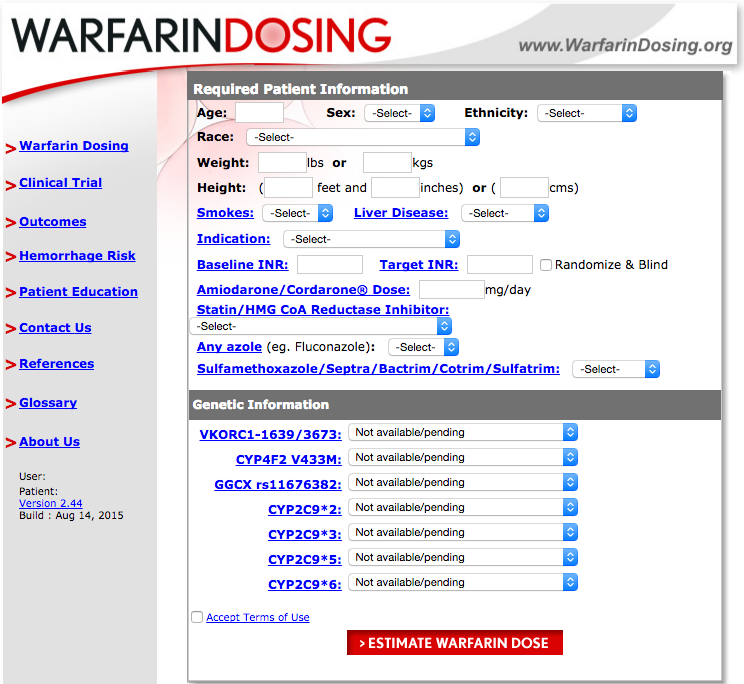

```{r setup, include=FALSE}
knitr::opts_chunk$set(echo = FALSE)
libraries <- c("readr", "knitr", "DT", "purrr", "lubridate", "stringr", "tidyr", "ggplot2", "broom", "dplyr","magrittr")
libs_to_install <- libraries[!(libraries %in% installed.packages()[,"Package"])]
if(length(libs_to_install)>0){install.packages(libs_to_install)}

library(magrittr)
library(knitr)
library(readr)
library(DT)
library(purrr)
library(lubridate)
library(stringr)
library(broom)
library(tidyr)
library(ggplot2)
library(dplyr)
```

## Case Study Motivation




## Case Study Overview

<div class = "goal">
  **Goal:** Reproduce the final pharmacogenomic regression model and create an interactive web dose calculator.
</div>
<br>


This study used clinical and genetic data from a broad population to estimate appropriate warfarin dose for patients newly starting warfarin.

The [main data set](https://www.pharmgkb.org/download.do?objId=553247439&objCls=SubmissionEvent&ext=.xls) for the study is available on [PharmGKB](https://www.pharmgkb.org/downloads/). 

## Data Set 


This data set is in an excel file and presents some challenges:

 -  Column names with odd symbols
 -  Data types change with different project sites

For the purpose of this tutorial I have reduced the complexity of the data set and converted it to a tab-delimited file available on my [GitHub ](https://github.com/laurakwiley/AMIA-2015---Using-R-for-Healthcare-Data-Science). We will use read.delim() to deal with the odd column names.

## Live Demo 

## Data Manipulation - Which Variables? {.smaller .columns-2}
 **They Used:**
 
 - Age in decades = 1 for 10-19, etc...
 - VKORC1 G/A = 1 if heterozygous
 - VKORC1 A/A = 1 if homozygous for A
 - VKORC1 genotype unknown = 1 
 - CYP2C9 \*1/\*2 = 1 if \*1/\*2
 - CYP2C9 \*1/\*3 = 1 if \*1/\*3
 - CYP2C9 \*2/\*2 = 1 if homozygous \*2 
 - CYP2C9 \*2/\*3 = 1 if \*2/\*3
 - CYP2C9 \*3/\*3 = 1 if homozygous \*3
 - CYP2C9 genotype unknown = 1 
 - Asian Race = 1
 - Black/African American = 1
 - Missing or Mixed race = 1
 
  <br>
  
 - Amiodarone status = 1
 - Enzyme inducer status = 1 if any of: rifampin, carbamazepine, phenytoin, rifampicin

  **We Have:**
  
 - Age: 10-19, 20-29, 30-39 etc.
 - VKORC1: A/A, A/G, G/G
 - CYP2C9: combinations of: \*1, \*2, \*3, \*5, \*6, \*8, \*11, etc.
 - Race: Asian, Black or African America, White, Other
 - Medications: character list of medications, lack of medications, etc.
 
## Live Demo 

