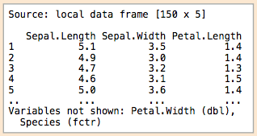
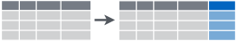

```{r setup, include=FALSE}
knitr::opts_chunk$set(echo = FALSE)
libraries <- c("readr", "knitr", "DT", "purrr", "lubridate", "stringr", "tidyr", "ggplot2", "broom", "tidyr","magrittr")
libs_to_install <- libraries[!(libraries %in% installed.packages()[,"Package"])]
if(length(libs_to_install)>0){install.packages(libs_to_install)}

library(magrittr)
library(knitr)
library(readr)
library(DT)
library(purrr)
library(lubridate)
library(stringr)
library(broom)
library(tidyr)
library(ggplot2)
library(dplyr)
```

## Setting Expectations {.build}

**Expect to:**

 1. Get a sense of what is possible with R.
 2. Set up important frameworks around how to do data science (forewarning - I'm biased!)
 3. Be warned of potential minefields

**Do Not Expect to:**

1. Completely understand all the code presented on your first try.
2. Be exposed to all of the features of the mentioned packages.


## The Data Scientist's Workflow


<div class="citation">
Adapted from:

 - David Robinson (http://varianceexplained.org/files/broom_presentation.pdf)
 - Philip Guo (http://cacm.acm.org/blogs/blog-cacm/169199-data-science-workflow-overview-and-challenges/fulltext)
</div>


## R Solutions 


## Preparation: Getting Data into R  {.smaller} 

```{r dataio_summary, results='asis',echo=FALSE}
data.frame(Library = c("Base R", 
                       "readr/<br>readxl/<br>haven",
                       "data.table",
                       "RODBC/<br>RJDBC"),
           Example_Functions = c("read.table(), read.csv()", 
                                 "read_delim(), read_csv(), read_excel(), read_sas()", 
                                 "fread",
                                 "sqlQuery()"),
           Pros = c("1. Built in<br>2. Can be helpful if field names are non-standard", 
                    "1. Extremely fast<br> 2. Shows progress bar<br>3. Automatically creates tbl_df() object", 
                    "1. Fastest data loading<br> 2. Don't have to specify delimiter",
                    "1. Easy to access databases with ODBC/JDBC Drivers"),
           Cons = c("1. StringsAsFactors = True<br>2. Slow on large data", 
                    "1. Doesn't handle non-standard field names well<br>2. Data type interpolation not great for non-standard data sets",
                    "1. Less sophisticated parser - can't recognize dates or factors automatically.<br>2. Does not handle edge cases well.",
                    "1. Can be slow depending on network connection")) %>% 
  datatable(colnames = c("", "Example Functions", "Pros", "Cons"), rownames = FALSE, escape = FALSE, options = list(pageLength = 12, bFilter = FALSE, info = FALSE, paging = FALSE, ordering = FALSE, columnDefs = list(list(className = "dt-center", targets = c(0))))) %>% formatStyle('Library', fontWeight = 'bold', `font-size` = '18px', backgroundColor = "Black", color = "White")
```
<br>
<div class="warning">
  <div class = "red2">**Warning:**</div>Each package has slightly different undesirable "features" so always check your data frame to make sure you're using the best option for your data set!
<div/>


## Preparation: Data Manipulation  {.smaller} 

<div align="center">
  <strong>tbl_df()</strong>
  <br>
  
</div>

<div class="columns-2">
 <strong>filter()</strong> <br>
 
 
 <strong>select()</strong>
 <br>
 
 
 <strong>summarise()</strong>
 <br>
 
 
<strong>mutate()</strong>
 <br>
 
  <br>
 </div>


## Using R for Reporting 

**Motivation** 

1. Easy mechanism for literate programming
2. Sharing and updating analyses trivial
    - With programmers/analysts/your future self
    - With information consumers (e.g., your boss)

<div class="columns-2">
  
  
</div>

## RMarkdown 


