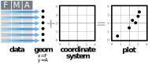
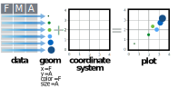
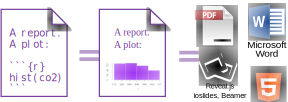
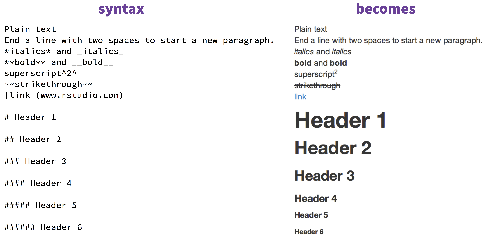

```{r setup, include=FALSE}
knitr::opts_chunk$set(echo = FALSE)
libraries <- c("readr", "knitr", "DT", "purrr", "lubridate", "stringr", "tidyr", "ggplot2", "broom", "tidyr","magrittr")
libs_to_install <- libraries[!(libraries %in% installed.packages()[,"Package"])]
if(length(libs_to_install)>0){install.packages(libs_to_install)}

library(magrittr)
library(knitr)
library(readr)
library(DT)
library(purrr)
library(lubridate)
library(stringr)
library(broom)
library(tidyr)
library(ggplot2)
library(dplyr)
```

## Setting Expectations {.build}

**Expect to:**

 1. Get a sense of what is possible with R.
 2. Set up important frameworks around how to do data science (forewarning - I'm biased!)
 3. Be warned of potential minefields

**Do Not Expect to:**

1. Completely understand all the code presented on your first try.
2. Be exposed to all of the features of the mentioned packages.


## The Data Scientist's Workflow


<div class="citation">
Adapted from:

 - David Robinson (http://varianceexplained.org/files/broom_presentation.pdf)
 - Philip Guo (http://cacm.acm.org/blogs/blog-cacm/169199-data-science-workflow-overview-and-challenges/fulltext)
</div>

## R Solutions 


## Important Operators  {.smaller}

The magrittr package introduced the concept of a pipe - an operator that takes the data on the left and passes it to the function on the right. 

<div align="center"><strong>Pre-Magrittr:</strong></div>

```{r bunny_foo_foo, eval=FALSE, echo=TRUE}
foo_foo <- little_bunny()

bop_on(scoop_up(hop_through(foo_foo, forest), field_mouse), head)
```

<br>
<div align="center"><strong>Post-Magrittr:</strong></div>

```{r bunny_foo_foo_pipe, eval=FALSE, echo=TRUE}
foo_foo <- little_bunny()

foo_foo %>% 
  hop_through(forest) %>% 
  scoop_up(field_mouse) %>% 
  bop_on(head)
```

<div class="citation">
Hadley Wickham: https://twitter.com/_inundata/status/557980236130689024
</div>

## Important Operators  {.smaller}

```{r pipes, results='asis',echo=FALSE}
data.frame(Pipe = c("%>%",
                    "%<>%",
                    "%T>%"),
           Function = c("Pass data from left to function on right and return results of the function, but don't change underlying data.", 
                        "Pass data from left to function on right, and save results of function to the original data frame.<br><em>Analagous to: dataframe <- dataframe %>% function()</em>", 
                        "Pass data from left to function on right, but return the original data frame instead of the result of the function")) %>% 
  datatable(colnames = c("", "Function"), rownames = FALSE, escape = FALSE, options = list(bFilter = FALSE, info = FALSE, paging = FALSE, ordering = FALSE, columnDefs = list(list(className = "dt-center", targets = c(0))))) %>% formatStyle('Pipe', fontWeight = 'bold', `font-size` = '32px', backgroundColor = "Black", color = "White") %>% formatStyle('Function', `font-size` = '20px')
```

## Preparation: Getting Data into R  {.smaller} 

```{r dataio_summary, results='asis',echo=FALSE}
data.frame(Library = c("Base R", 
                       "readr/<br>readxl/<br>haven",
                       "data.table",
                       "RODBC/<br>RJDBC"),
           Example_Functions = c("read.table(), read.csv()", 
                                 "read_delim(), read_csv(), read_excel(), read_sas()", 
                                 "fread",
                                 "sqlQuery()"),
           Pros = c("1. Built in<br>2. Can be helpful if field names are non-standard", 
                    "1. Extremely fast<br> 2. Shows progress bar<br>3. Automatically creates tbl_df() object", 
                    "1. Fastest data loading<br> 2. Don't have to specify delimiter",
                    "1. Easy to access databases with ODBC/JDBC Drivers"),
           Cons = c("1. StringsAsFactors = True<br>2. Slow on large data", 
                    "1. Doesn't handle non-standard field names well<br>2. Data type interpolation not great for non-standard data sets",
                    "1. Less sophisticated parser - can't recognize dates or factors automatically.<br>2. Does not handle edge cases well.",
                    "1. Can be slow depending on network connection")) %>% 
  datatable(colnames = c("", "Example Functions", "Pros", "Cons"), rownames = FALSE, escape = FALSE, options = list(pageLength = 12, bFilter = FALSE, info = FALSE, paging = FALSE, ordering = FALSE, columnDefs = list(list(className = "dt-center", targets = c(0))))) %>% formatStyle('Library', fontWeight = 'bold', `font-size` = '18px', backgroundColor = "Black", color = "White")
```
<br>
<div class="warning">
  <div class = "red2">**Warning:**</div>Each package has slightly different undesirable "features" so always check your data frame to make sure you're using the best option for your data set!
<div/>

## Preparation: Data Manipulation 

<div>
   
  
  <p style="margin-left:8em;">Especially with health care data (EHR) or secondary uses of data not collected primarily for future analysis, the vast majority of my time is spent performing data cleaning and data manipulation tasks.</p>
</div>
<hr>


## Preparation: Data Manipulation  {.smaller} 

<div align="center">
  <strong>tbl_df()</strong>
  <br>
  
</div>

<br>

<div class="columns-2">
  <strong>filter()</strong> 
  <br>
  
 
  <strong>select()</strong>
  <br>
  
 
  <strong>summarise()</strong>
  <br>
  
 
  <strong>mutate()</strong>
  <br>
  
  <br>
</div>

## Preparation: Data Manipulation  {.smaller} 

dplyr also has support for grouping functions that alter the behavior of the previous verbs.  To group a variabll simply add group_by() argument.

```{r group_by_exmple, eval=FALSE}
my_tbl_df %>% 
  group_by(mygrouping_column)
```

<div align="center"><strong>group_by() %>% summarise()</strong></div>
<br>

  
<div align="center"><strong>group_by() %>% mutate()</strong></div>
<br>


## Preparation: Data Manipulation   

<strong>Primary Functions:</strong>

<div class="columns-2">
  <div align="center"><strong>gather()</strong></div>
  <br>
  
 
  <div align="center"><strong>spread()</strong></div>
  <br>
  
 
  <div align="center"><strong>separate()</strong></div>
  <br>
  
 
  <br><br>
  <div align="center"><strong>unite()</strong></div>
  <br>
  
  <br>
</div>

## Preparation: Data Manipulation 

<div>
   
  
  <p style="margin-left:8em;"><br>Both stringr and lubridate help ease string and date functions respectively. </p>
</div>

<br><br>

<div class="columns-2">
Although the string functions in R are actually not bad, some of them behave in unexpected ways. Stringr tries to fix these to make it easier and intuitive.
<br>
<div align="right">Dates in R can be a mess, lubridate makes it easy to manipulate dates and do hard thing things like date ranges and comparing dates.</div>
</div>
<br>
<div class="warning">Please note that stringr uses ICU Regular expressions  which means the can behave differently than expected based on R documentation. However you can simply use the regex() function to change back to perl regular expressions.</div>

## R Solutions 


## Analysis: Model Tidying {.smaller}

```{r regression_example, echo = TRUE}
mtcars %>% 
  lm(formula = mpg ~ cyl + disp) %>% 
  summary()
```

## Analysis: Model Tidying  {.smaller}

<br><br>

```{r broom_example1a, echo = TRUE, eval = FALSE, out.width='450px'}
mtcars %>% 
  lm(formula = mpg ~ cyl + disp) %>% 
  tidy()
```

```{r broom_example1b}
mtcars %>% 
  lm(formula = mpg ~ cyl) %>% 
  tidy() %>% 
  datatable(rownames = FALSE, escape = FALSE, options = list(pageLength = 12, bFilter = FALSE, info = FALSE, paging = FALSE, ordering = FALSE, columnDefs = list(list(className = "dt-center", targets = c(0:4)))))
```

```{r broom_example2a, echo = TRUE, eval = FALSE, out.width='450px'}
mtcars %>% 
  lm(formula = mpg ~ cyl + disp) %>% 
  glance()
```

```{r broom_example2b}
mtcars %>% 
  lm(formula = mpg ~ cyl) %>% 
  glance() %>% 
  datatable(rownames = FALSE, escape = FALSE, options = list(scrollX = TRUE, bFilter = FALSE, info = FALSE, paging = FALSE, ordering = FALSE, columnDefs = list(list(className = "dt-center", targets = c(0:4))))) %>% formatRound(columns = c(1:5,7:10), 3) 
```

## Analysis: Graphs 

<br><br>

```{r ggplot, eval = FALSE, echo = TRUE, out.width='350px'}
ggplot(data, aes(x = F, y = a)) + geom_point()
```



## Analysis: Graphs 

<br><br>

```{r ggplot2, eval = FALSE, echo = TRUE}
ggplot(data, aes(x = F, y = a, color = F, size = A)) + geom_point()
```




## R Solutions 


## Dissemination: Reports  {.smaller}

Knitr takes an RMarkdown document - markdown formatted text with intersperced R code - and turns them into documents. 


<hr>
<div class="columns-2">
  
  
</div>

## Dissemination: Reports  {.smaller}



## Dissemination: Web Apps  {.smaller}

<iframe src="http://159.203.246.118/shiny/mtcars_App/" style="border: none; width: 800px; height: 600px"></iframe>


